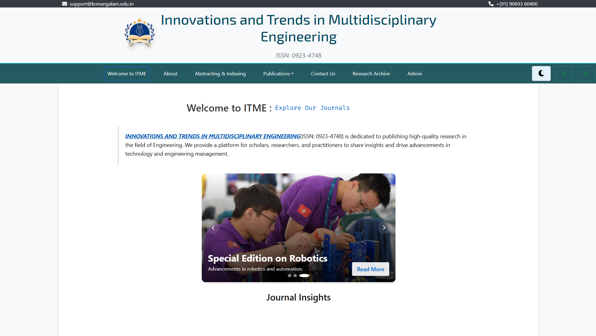

<h1 align="center">🧠 ITME Journal Publication Website</h1>

<p align="center">
  <b>INNOVATIVE TRENDS IN MULTIDISCIPLINARY ENGINEERING</b><br/>
  <i>Research Paper Submission & Review System</i>
</p>

> Originally branded as **PEI – Pioneering Engineering Insight**, now rebranded to **ITME**.

<div style="width: 200px; height: 200px; border-radius: 50%; overflow: hidden;">
  
</div>


---

## 👥 Team Members

<table>
  <tr>
    <td><b>Piyush Kumar Sharma</b></td>
    <td>B.Tech CSE (AI & ML)</td>
    <td>Roll No: 2401730173</td>
  </tr>
  <tr>
    <td><b>Yashraj Pahuja</b></td>
    <td>B.Tech CSE (AI & ML)</td>
    <td>Roll No: 2401730205</td>
  </tr>
</table>

---

## 📌 Project Overview

The **ITME Journal Publication Website** is a full-stack research submission system built using the MERN stack.  
It enables authors to upload their research papers in PDF format, track their status, and receive email updates.  
Admins can manage submissions, review papers, and send decisions to authors automatically.

> Originally branded as **PEI – Pioneering Engineering Insight**, now rebranded to **ITME**.

---

## ✨ Key Features

- Upload and preview research papers (PDF.js)
- OTP-based user registration and login
- Admin panel for status updates and paper reviews
- Email notifications using Nodemailer
- Responsive frontend for authors & admins
- Real-time status updates

---

## 🛠️ Tech Stack

| Layer       | Tools Used                             |
|------------|------------------------------------------|
| Frontend   | React.js, Tailwind CSS                   |
| Backend    | Node.js, Express.js                      |
| Database   | MongoDB Atlas / VPS-hosted MongoDB       |
| Auth       | JWT, OTP verification                    |
| PDF Viewer | PDF.js (v4.7.76)                         |
| Email      | Nodemailer (SMTP)                        |
| File Store | Server-side (`/uploads/`)                |

---

## 🗂️ File Structure

```bash
Piyush_Sharma_CSEAIMLB_ITME1/
├── backend/
│   ├── controllers/
│   ├── models/
│   ├── routes/
│   ├── uploads/             # PDF files
│   └── server.js
├── frontend/
│   ├── public/
│   ├── src/
│   │   ├── components/
│   │   ├── pages/
│   │   └── App.jsx
├── .env
├── README.md
└── package.json
```
---

## 📹 Demo Video

<p align="center">
  <a href="https://drive.google.com/file/d/17AKyfIHbAo9vpoaO5KWR0EYQYAxDKdgD/preview" target="_blank">
    
  </a>
</p>

>or

<p align="center">
  <a href="https://drive.google.com/file/d/17AKyfIHbAo9vpoaO5KWR0EYQYAxDKdgD/preview" target="_blank">
    click here
  </a>
</p>

> Click the preview to watch the demonstration.

---

## 📄 Project Report

You can view or download the final report of this project using the links below:

### 🔍 View Online  
[📖 View Project Report (GitHub Preview)](https://github.com/ScienHAC/Piyush_Sharma_CSEAIMLB_ITME/blob/main/Project-Report.pdf)

### 📥 Direct Download  
[⬇️ Download Project Report (Raw Link)](https://raw.githubusercontent.com/ScienHAC/Piyush_Sharma_CSEAIMLB_ITME/main/Project-Report.pdf)

---

<p align="center">
  <a href="https://raw.githubusercontent.com/ScienHAC/Piyush_Sharma_CSEAIMLB_ITME/main/Project-Report.pdf" download>
    
  </a>
</p>

---

## 🧾 License

This is an academic project submitted as part of university coursework.  
You are free to **reference** or **reuse with proper attribution**.

---

## ⭐ Acknowledgements

- Our faculty mentors for their constant support  
- Reviewers and friends who provided valuable feedback  
- Open-source contributors whose tools made this possible  

---

## Getting Started

### 1. Clone the Repository

```bash
git clone https://github.com/ScienHAC/Piyush_Sharma_CSEAIMLB_ITME1.git
cd Piyush_Sharma_CSEAIMLB_ITME1
```

### 2. Backend Setup

```bash
cd backend
npm install
```

Create `.env` file inside `backend/`:

```env
PORT=5000  
MONGO_URI=your_mongo_url  
JWT_SECRET=your_secret  
EMAIL_USER=your_email@example.com  
EMAIL_PASS=your_password
```

Start Backend:

```bash
npm start
```

### 3. Frontend Setup

```bash
cd ../frontend
npm install
npm run dev
```

> App runs on [http://localhost:5000](http://localhost:5000)

---

<p align="center">
  Made with ❤️ by <b>Piyush Sharma</b> and <b>Yashraj Pahuja</b>
</p>

---
